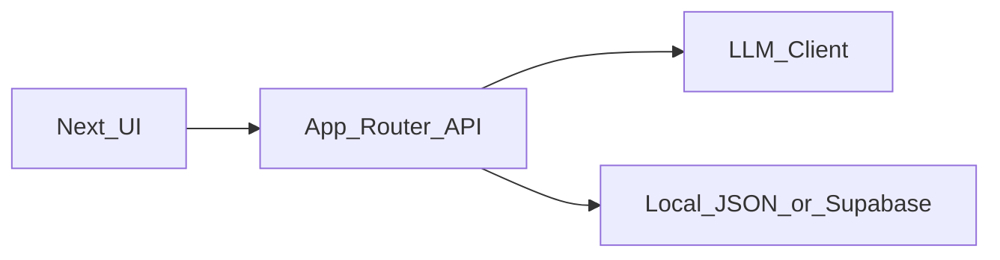

# AI Resume Tailor — Phase-Based Implementation Plan

---

## 0. Product Positioning

AI Resume Tailor is a **workflow-based AI system** that:

* Parses job descriptions
* Matches them with structured project data
* Generates evidence-grounded resume content
* Identifies skill gaps and recommends next steps

Core principle:

> This is NOT a chat agent. It is a structured decision workflow.

---

## Execution priority (how this doc relates to shipping)

* **Primary goal right now**: ship a **usable MVP** — follow **[plan_mvp.md](plan_mvp.md)** (Next.js + **n8n** orchestration + local `projects.json` → API proxy → UI; Supabase when you need persistence).
* **This file (`plan.md`)** is the **full-product north star**: richer **data model** (`profiles` / `profileId`, bilingual output, structured **impact** split), **Zod** everywhere, and an **alternative implementation path** (all logic in Next.js via `llmClient` + Route Handlers **without n8n**) if you later collapse orchestration into the app.
* **Do not** block the MVP on bilingual UX, multi-profile UI, or full Zod coverage — add those **after** the n8n workflow + UI path is demonstrably usable.

| MVP phase ([plan_mvp.md](plan_mvp.md)) | Maps to themes in this doc |
| --- | --- |
| Phase 1–2 (workflow + Next.js) | Same user-visible outcome as Phase 1–2 here (pipeline + UI), different stack (n8n vs in-app LLM) |
| Phase 3 (Supabase) | Same intent as persistence / Supabase sections here (align tables when you migrate) |
| Phase 4+ (hardening, UX polish) | Overlaps Phase 2–5 here (prompts, validation, productization) |

---

## Tech Stack & Repository Structure (Phase 1)

* **Stack**: TypeScript full stack — **Next.js App Router**; LLM calls run on the **server** (Route Handlers and/or Server Actions). **MVP note**: if you use [plan_mvp.md](plan_mvp.md), LLM calls live in **n8n** until you port them to `llmClient` here.
* **Validation**: **Zod** from Phase 1 for local JSON shapes and API request/response contracts (aligned with Phase 2 structured outputs).
* **Suggested layout**:
  * `app/api/*` — JD parse, match, resume, gap analysis endpoints
  * `lib/` — schemas, matching, prompts, `llmClient` (or equivalent)
  * `data/` — local JSON (`profiles.json` and `projects.json`, or a single file with a `profiles` array)
* **Environment variables**: `OPENAI_API_KEY` (or generic `LLM_*` names for future providers); reserve placeholders for Phase 4 Supabase (`NEXT_PUBLIC_SUPABASE_URL`, `SUPABASE_ANON_KEY`, service role if needed, etc.) when integrated.

---

## LLM Default Implementation & Replaceability

* **Default provider**: **OpenAI API** for the first implementation (mature structured-output tooling and docs). Use a cost-effective default model (e.g. **gpt-4o-mini**) to run the full pipeline; move to a larger model when stronger reasoning is required.
* **Abstraction**: Implement a server-side **`llmClient`** (or equivalent module) so Route Handlers depend on a thin API; inputs and outputs are **Zod-validated** types.
* **Extension**: Use env vars such as `LLM_PROVIDER` and `OPENAI_API_KEY` so another provider can be swapped without changing the workflow graph.
* **Optional later**: If hosting on Vercel and you want unified streaming/UI patterns, consider **Vercel AI SDK** behind the same abstraction — **not** a Phase 1 requirement.

---

## Phase 1 — Foundation (Static Workflow + Local Data)

### Goal

Establish a complete **end-to-end pipeline using static data** (no database, minimal UI).

---

### Deliverables

* Project schema defined
* Local data: **`projects.json`** + **`profiles.json`** (or one JSON file containing a `profiles` array). Phase 1–3 assume a **single real user**; the schema **reserves multiple profiles** (`id`, fields below) so Phase 4 (Supabase + Auth) does not require a redesign.
* JD parsing API
* Project matching logic (rule-based + LLM explanation)
* Resume generation API
* Gap analysis API
* Basic UI to run full flow

---

### Implementation

#### 1. Data Layer (Local JSON)

* **Profiles** (each entry in `profiles.json` or the `profiles` array):
  * `id` (stable string/UUID)
  * `name`, `target_role` (and any headline fields you need)
  * `defaultOutputLocale` (or `localePreference`): e.g. `zh`, `en`, or `auto` — drives resume/gap **output language** when not overridden in the UI
* **Projects**:
  * Each project references **`profileId`** (FK-style) so multiple profiles can reuse or partition project libraries in Phase 4.
  * Schema fields include:
    * techStack
    * responsibilities
    * **impact** — split **verified quantified facts** vs **qualitative claims** (e.g. separate `metricsVerified` / `narrative`) so the LLM **cannot invent numbers** and prompts can forbid fabricating metrics not present in structured fields
    * evidenceLevel

#### 2. JD Parsing

* Use LLM with structured output
* Extract:

  * role
  * required skills
  * preferred skills
  * responsibilities
  * keywords
* **Bilingual pipeline**: detect or accept **JD language** (`zh` / `en` / mixed). Parsed fields should retain language context for matching and generation. **Output language rule (pick one for Phase 1 and stick to it in acceptance tests)**:
  * **Recommended default**: **User-selected output language** in the UI (and/or `defaultOutputLocale` on the profile) **independent of JD language**, so scenarios like *English JD → Chinese resume* are first-class.
* Prompts must instruct the model to follow the chosen output locale for generated resume bullets and gap analysis text.

#### 2b. Bilingual Acceptance (Phase 1)

* Manual or scripted checks: at minimum **two cross-language runs** — (1) **English JD → Chinese resume output**, (2) **Chinese JD → English resume output** — with no obvious language drift in section headings and bullets unless intentionally bilingual.

#### 3. Matching Engine

* Hybrid approach:

  * Rule-based scoring:

    * skill overlap
    * domain overlap
    * evidence weighting
  * LLM generates:

    * match reasoning
    * gap hints

#### 4. Resume Generation

* Input:

  * selected projects
  * parsed JD
  * **output locale** (from UI and/or profile `defaultOutputLocale`)
* Output:

  * summary
  * bullet points
* Constraints:

  * no hallucination
  * no fake metrics — only use numbers from structured **verified** impact fields
  * must be grounded in input data
  * generated text **matches the selected output locale** (zh / en)

#### 5. Gap Analysis

* Output:

  * rewrite opportunities
  * true skill gaps
  * suggested next project
* Gap narrative follows the **same output locale** as resume generation for consistency.

---

### Acceptance Criteria

* End-to-end flow works from JD input → final output
* Outputs are structured (JSON)
* No obvious hallucinations
* Matching results are explainable
* UI can display all outputs clearly
* **Bilingual**: English JD → Chinese resume and Chinese JD → English resume both meet quality bar (see §2b above)
* **Profiles**: local data model supports **multiple profile records** and `profileId` on projects, even if the UI only edits one profile in Phase 1–3

---

### Risks

* Model hallucination
* Weak matching quality
* Overly generic bullet generation
* Mixed-language outputs if locale is not enforced in prompts and validation

---

## Phase 2 — Stability & Quality (Make It Reliable)

### Goal

Turn the system from “can run” into **consistent and trustworthy**

---

### Deliverables

* Prompt refinement
* Output validation (Zod)
* Anti-hallucination constraints
* Error handling + fallback logic
* Improved scoring system

---

### Implementation

#### 1. Prompt Hardening

Add strict rules:

* Only use provided evidence
* Do not invent metrics
* Distinguish:

  * direct experience
  * transferable skills

#### 2. Structured Validation

* Use Zod schemas for all outputs
* Reject malformed responses
* Retry strategy if validation fails
* **Bilingual**: validate `locale` (or equivalent) with a **string enum** (`zh` | `en` | …); ensure resume/gap sections stay structurally consistent across locales

#### 3. Scoring Optimization

Refine rule-based scoring:

* weighted skill match
* evidenceLevel weighting
* keyword density

#### 4. Failure Handling

* API timeout fallback
* empty result fallback
* partial result handling

---

### Acceptance Criteria

* Same input produces consistent outputs
* No fabricated experience
* Matching feels “reasonable” across different JDs
* System does not crash on bad inputs

---

### Risks

* Over-constraining prompts → robotic output
* Retry loops increasing latency/cost

---

## Phase 3 — UX & Productization

### Goal

Make the system usable as a **real tool, not just a demo**

---

### Deliverables

* Clean UI layout
* Loading states
* Error states
* Copy/export functionality
* Multiple JD testing

---

### Implementation

#### UI Structure

1. JD Input Panel
2. Parsed JD View
3. Matched Projects Panel
4. Output Panel:

   * Summary
   * Bullets
   * Gap Analysis

#### UX Improvements

* loading indicators
* section-based rendering
* copy buttons (markdown / text)
* **Language / output mode**: control for **resume + gap output language** (aligns with Phase 1 `defaultOutputLocale` / user override)

---

### Acceptance Criteria

* User can run full flow without confusion
* Output is readable and usable
* No blocking UI issues
* User can set or override **output language** without editing JSON

---

### Risks

* Over-design UI
* Spending too much time on styling vs functionality

---

## Phase 4 — Persistence Layer (Supabase Integration)

### Goal

Introduce **data persistence without breaking core workflow**

---

### Deliverables

* Supabase integration
* Project storage
* Analysis history storage

---

### Implementation

#### Tables

**profiles** (columns **aligned** with Phase 1 local profile JSON — same field names and semantics where possible to avoid migration churn)

* id
* name
* target_role
* default_output_locale (text; mirrors `defaultOutputLocale` in local JSON)
* (future: user id / auth subject when multi-user)

**projects**

* id
* profile_id (FK → profiles)
* name
* tech_stack (jsonb)
* responsibilities (jsonb)
* impact (jsonb) — same split as local data: verified metrics vs narrative, not flat prose only
* evidence_levels (jsonb)

**job_analyses**

* id
* profile_id (FK → profiles) — ties analysis history to a profile for multi-profile libraries
* jd_text
* parsed_jd (jsonb)
* match_results (jsonb)
* outputs (jsonb)

---

#### Data Strategy

* Prefer Supabase
* Fallback to local JSON if needed

#### Auth & RLS (phased)

* **Phase 4 v1**: avoid complex **RLS** — e.g. single-developer use with **service role** on the server, or minimal anon policies until multi-user is real.
* **Later**: add Supabase Auth and tighten **RLS** per user when the product is multi-tenant; local schema already separates **profiles** and `profile_id` on projects and job analyses.

---

### Acceptance Criteria

* Data persists across sessions
* No breaking changes to workflow
* Read/write operations stable
* **Supabase `profiles` / `projects` / `job_analyses` match** Phase 1 JSON shapes closely enough that import/export or dual-write is straightforward

---

### Risks

* Over-engineering schema
* Debugging auth/RLS issues — **mitigate** by deferring strict RLS until multi-user (see above)

---

## Phase 5 — Advanced Capabilities (Optional)

### Goal

Extend system toward **agent-like behavior** (keep **cross-language tailoring** as a demo story in Phase 6 when showcasing differentiation)

---

### Potential Features

* Multi-step planning
* Automatic skill selection
* Multi-role resume generation
* Portfolio recommendation system
* Multi-JD comparison

---

### Important Constraint

Do NOT introduce agents unless:

* workflow is already stable
* outputs are reliable

---

## Phase 6 — Portfolio & Interview Readiness

### Goal

Turn project into a **hireable asset**

---

### Deliverables

* README (problem → solution → architecture)
* Architecture diagram
* 3 demo scenarios (include **at least one cross-language tailoring** scenario: e.g. English JD → localized resume)
* 2-minute explanation script

---

### Key Talking Points

1. Why workflow over agent
2. How hallucination is controlled
3. Why structured data matters
4. Tradeoff between rule-based and LLM

---

### Acceptance Criteria

* You can clearly explain system design
* You can justify tradeoffs
* You can demo it confidently

---

## Final Definition of Done

The project is complete when:

* End-to-end workflow is stable
* Outputs are reliable and grounded
* System is usable by another person
* You can explain architecture and tradeoffs clearly

---

## Appendix — High-Level Architecture

---

## Core Insight

> This project is not about “using AI”.
> It is about designing a system where AI behaves predictably.

---
