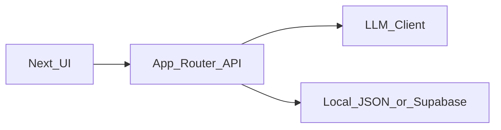

# AI Resume Tailor — 分阶段实施计划

---

## 0. 产品定位

AI Resume Tailor 是一个**基于工作流的 AI 系统**，能够：

* 解析职位描述（JD）
* 与结构化项目数据匹配
* 生成有证据支撑的简历内容
* 识别技能缺口并建议下一步

核心原则：

> 这不是聊天机器人，而是**结构化的决策工作流**。

---

## 执行优先级（与落地路线的关系）

* **当前首要目标**：先做出**可用的 MVP** — 按 **[plan_mvp.md](plan_mvp.md)** 执行（Next.js + **n8n** 编排 + 本地 `projects.json` → API 代理 → UI；需要持久化再上 Supabase）。
* **本文件（`plan.md`）** 是**完整产品**的 north star：更完整的数据模型（`profiles` / `profileId`、双语输出、结构化 **impact**）、**Zod**、以及**可选**的纯代码路径（Next.js `llmClient` + Route Handlers，**不用 n8n**）——若日后把编排收进应用内可用。
* **不要**在 MVP 跑通之前，用双语、多 profile UI 或全量 Zod **卡住交付**；n8n 工作流 + UI 能稳定演示后，再按本文件逐步升级。

| MVP 阶段（[plan_mvp.md](plan_mvp.md)） | 与本文件的对应关系 |
| --- | --- |
| 阶段 1–2（工作流 + Next.js） | 用户可见结果与本文件阶段 1–2 类似，**栈不同**（n8n vs 应用内 LLM） |
| 阶段 3（Supabase） | 与本文件持久化 / Supabase 意图一致（迁移时对齐表结构） |
| 阶段 4+（加固、体验） | 与本文件阶段 2–5 主题重叠（prompt、校验、产品化） |

---

## 技术栈与仓库结构（阶段 1）

* **技术栈**：TypeScript 全栈 — **Next.js App Router**；LLM 调用在**服务端**执行（Route Handlers 与/或 Server Actions）。**MVP 说明**：若采用 [plan_mvp.md](plan_mvp.md)，在迁移到本文件的 `llmClient` 之前，LLM 调用在 **n8n** 内完成。
* **校验**：从阶段 1 起使用 **Zod** 约束本地 JSON 形态与 API 请求/响应契约（与阶段 2 结构化输出一致）。
* **建议目录**：
  * `app/api/*` — JD 解析、匹配、简历、缺口分析等接口
  * `lib/` — schema、匹配逻辑、prompt、`llmClient`（或等价模块）
  * `data/` — 本地 JSON（`profiles.json` 与 `projects.json`，或单文件内含 `profiles` 数组）
* **环境变量**：`OPENAI_API_KEY`（或通用 `LLM_*` 命名以便后续换供应商）；阶段 4 接入 Supabase 时预留占位（如 `NEXT_PUBLIC_SUPABASE_URL`、`SUPABASE_ANON_KEY`、必要时 service role 等）。

---

## LLM 默认实现与可替换性

* **默认供应商**：首版实现采用 **OpenAI API**（结构化输出工具与文档成熟）。默认使用成本较低的模型（如 **gpt-4o-mini**）跑通全流程；需要更强推理时再换更大模型。
* **抽象**：在服务端实现 **`llmClient`**（或等价模块），Route Handlers 只依赖薄封装；入参/出参均为 **Zod 校验**后的类型。
* **扩展**：通过 `LLM_PROVIDER`、`OPENAI_API_KEY` 等环境变量，在不改工作流拓扑的前提下更换供应商。
* **可选后续**：若部署在 Vercel 且希望统一流式/UI 模式，可在同一抽象下评估 **Vercel AI SDK** — **不是**阶段 1 的必选项。

---

## 阶段 1 — 基础（静态工作流 + 本地数据）

### 目标

用**静态数据**跑通完整**端到端管线**（无数据库、最小 UI）。

---

### 交付物

* 项目 schema 定义完成
* 本地数据：**`projects.json`** + **`profiles.json`**（或单文件内含 `profiles` 数组）。阶段 1–3 假定**单一真实用户**；schema **预留多份 profile**（`id` 及下文字段），避免阶段 4（Supabase + Auth）时推翻重来。
* JD 解析 API
* 项目匹配逻辑（规则 + LLM 解释）
* 简历生成 API
* 缺口分析 API
* 能跑通全流程的基础 UI

---

### 实现要点

#### 1. 数据层（本地 JSON）

* **Profile**（`profiles.json` 或 `profiles` 数组中每一项）：
  * `id`（稳定字符串/UUID）
  * `name`、`target_role`（及所需标题类字段）
  * `defaultOutputLocale`（或 `localePreference`）：如 `zh`、`en` 或 `auto` — 在未在 UI 中覆盖时，决定简历/缺口**输出语言**
* **项目（Projects）**：
  * 每个项目引用 **`profileId`**（外键风格），便于阶段 4 多 profile 复用或划分项目库。
  * Schema 字段包括：
    * techStack
    * responsibilities
    * **impact** — 区分**已验证的量化事实**与**定性表述**（如拆分 `metricsVerified` / `narrative`），避免 LLM **编造数字**，并在 prompt 中禁止使用结构化字段中不存在的指标
    * evidenceLevel

#### 2. JD 解析

* 使用 LLM + 结构化输出
* 抽取：
  * 岗位
  * 必备技能
  * 加分技能
  * 职责
  * 关键词
* **双语管线**：检测或由用户指定 **JD 语言**（`zh` / `en` / 混合）。解析结果保留语言上下文供匹配与生成。**输出语言规则（阶段 1 选定一种并在验收中固定）**：
  * **推荐默认**：**由用户在 UI 中选择输出语言**（与 profile 上 `defaultOutputLocale` 组合），**与 JD 语言解耦**，使 *英文 JD → 中文简历* 等场景为一等公民。
* Prompt 须要求模型在生成简历要点与缺口分析时遵循所选输出语言环境。

#### 2b. 双语验收（阶段 1）

* 手工或脚本：至少 **两次跨语言运行** —（1）**英文 JD → 中文简历输出**，（2）**中文 JD → 英文简历输出** — 除非故意双语，否则章节标题与要点不应明显语言混杂。

#### 3. 匹配引擎

* 混合方式：
  * 规则打分：
    * 技能重叠
    * 领域重叠
    * 证据权重
  * LLM 生成：
    * 匹配理由
    * 缺口提示

#### 4. 简历生成

* 输入：
  * 选中的项目
  * 解析后的 JD
  * **输出语言**（来自 UI 与/或 profile 的 `defaultOutputLocale`）
* 输出：
  * 摘要
  * 要点（bullet）
* 约束：
  * 不幻觉
  * 不伪造指标 — 数字仅来自结构化字段中的**已验证** impact
  * 必须可追溯到输入数据
  * 生成文本**符合所选输出语言**（zh / en）

#### 5. 缺口分析

* 输出：
  * 可改写机会
  * 真实技能缺口
  * 建议的下一个项目
* 缺口叙述与简历生成使用**同一输出语言**，保持一致。

---

### 验收标准

* 从 JD 输入到最终输出端到端可用
* 输出为结构化（JSON）
* 无明显幻觉
* 匹配结果可解释
* UI 能清晰展示全部输出
* **双语**：英文 JD→中文简历、中文 JD→英文简历均达到可接受质量（见上文 §2b）
* **Profile**：本地数据模型支持**多条 profile** 与项目上的 `profileId`，即使阶段 1–3 UI 只编辑一个 profile

---

### 风险

* 模型幻觉
* 匹配质量弱
* 要点生成过于泛泛
* 若未在 prompt 与校验中强制 locale，易出现中英混杂输出

---

## 阶段 2 — 稳定与质量（可靠）

### 目标

从「能跑」变成**稳定、可信**。

---

### 交付物

* Prompt 打磨
* 输出校验（Zod）
* 反幻觉约束
* 错误处理与降级
* 改进打分体系

---

### 实现要点

#### 1. Prompt 加固

严格规则：

* 仅使用所给证据
* 不编造指标
* 区分：
  * 直接经验
  * 可迁移技能

#### 2. 结构化校验

* 所有输出使用 Zod schema
* 拒绝畸形响应
* 校验失败时的重试策略
* **双语**：用**字符串枚举**校验 `locale`（或等价字段）（`zh` | `en` | …）；保证不同语言下简历/缺口章节结构一致

#### 3. 打分优化

改进规则分：

* 加权技能匹配
* evidenceLevel 权重
* 关键词密度

#### 4. 失败处理

* API 超时降级
* 空结果降级
* 部分结果处理

---

### 验收标准

* 相同输入产生稳定输出
* 不捏造经历
* 不同 JD 下匹配「说得通」
* 坏输入下系统不崩溃

---

### 风险

* Prompt 过严 → 输出呆板
* 重试增加延迟与成本

---

## 阶段 3 — 体验与产品化

### 目标

让系统成为**真正可用的工具**，而非仅 demo。

---

### 交付物

* 清晰 UI 布局
* 加载态
* 错误态
* 复制/导出
* 多份 JD 测试能力

---

### 实现要点

#### UI 结构

1. JD 输入区
2. 解析结果视图
3. 匹配项目面板
4. 输出区：
   * 摘要
   * 要点
   * 缺口分析

#### 体验优化

* 加载指示
* 分区块渲染
* 复制按钮（Markdown / 纯文本）
* **语言/输出模式**：控制**简历 + 缺口**的输出语言（与阶段 1 的 `defaultOutputLocale` / 用户覆盖一致）

---

### 验收标准

* 用户能不困惑地跑完全流程
* 输出可读、可用
* 无阻塞级 UI 问题
* 用户**无需改 JSON** 即可设置或覆盖**输出语言**

---

### 风险

* UI 过度设计
* 在样式上耗时过多、挤压功能

---

## 阶段 4 — 持久化层（Supabase）

### 目标

引入**数据持久化**，且不破坏核心工作流。

---

### 交付物

* Supabase 集成
* 项目存储
* 分析历史存储

---

### 实现要点

#### 表结构

**profiles**（列与阶段 1 本地 profile JSON **对齐** — 字段名与语义尽量一致，减少迁移成本）

* id
* name
* target_role
* default_output_locale（text；对应本地 JSON 的 `defaultOutputLocale`）
* （未来：多用户时的 user id / auth subject）

**projects**

* id
* profile_id（FK → profiles）
* name
* tech_stack (jsonb)
* responsibilities (jsonb)
* impact (jsonb) — 与本地一致：量化与叙述拆分，而非仅一段散文
* evidence_levels (jsonb)

**job_analyses**

* id
* profile_id（FK → profiles）— 将分析历史挂到 profile，支持多 profile 库
* jd_text
* parsed_jd (jsonb)
* match_results (jsonb)
* outputs (jsonb)

---

#### 数据策略

* 优先 Supabase
* 需要时可回退本地 JSON

#### 认证与 RLS（分阶段）

* **阶段 4 v1**：避免复杂 **RLS** — 例如单人开发用服务端 **service role**，或多用户未就绪前仅用最小 anon 策略。
* **后续**：产品多租户时再上 Supabase Auth 并收紧 **RLS**；本地 schema 已区分 **profiles** 以及 projects、job_analyses 上的 `profile_id`。

---

### 验收标准

* 会话间数据持久
* 对工作流无破坏性变更
* 读写稳定
* **Supabase 中 `profiles` / `projects` / `job_analyses`** 与阶段 1 JSON 形态足够接近，便于导入/导出或双写

---

### 风险

* Schema 过度设计
* 调试 auth/RLS — **缓解**：多用户就绪前推迟严格 RLS（见上）

---

## 阶段 5 — 进阶能力（可选）

### 目标

向**类 Agent** 能力延伸（阶段 6 展示差异化时，保留**跨语言 tailoring** 作为演示故事）

---

### 可能功能

* 多步规划
* 自动技能选择
* 多角色简历生成
* 作品集推荐
* 多 JD 对比

---

### 重要约束

仅在以下条件满足时再引入 Agent：

* 工作流已稳定
* 输出可靠

---

## 阶段 6 — 作品集与面试准备

### 目标

把项目变成**可拿去求职的资产**。

---

### 交付物

* README（问题 → 方案 → 架构）
* 架构图
* 3 个 demo 场景（至少包含 **一个跨语言 tailoring** 场景：如英文 JD → 本地化简历）
* 约 2 分钟口述稿

---

### 关键叙述点

1. 为何工作流优于 Agent
2. 如何控制幻觉
3. 为何结构化数据重要
4. 规则与 LLM 的权衡

---

### 验收标准

* 能讲清系统设计
* 能论证权衡
* 能自信演示

---

## 最终完成定义

项目在以下条件满足时视为完成：

* 端到端工作流稳定
* 输出可靠、有依据
* 其他人也能使用
* 能讲清架构与权衡

---

## 附录 — 高层架构

---

## 核心观点

> 本项目重点不是「用了 AI」。
> 而是设计一套让 AI **行为可预期**的系统。

---
